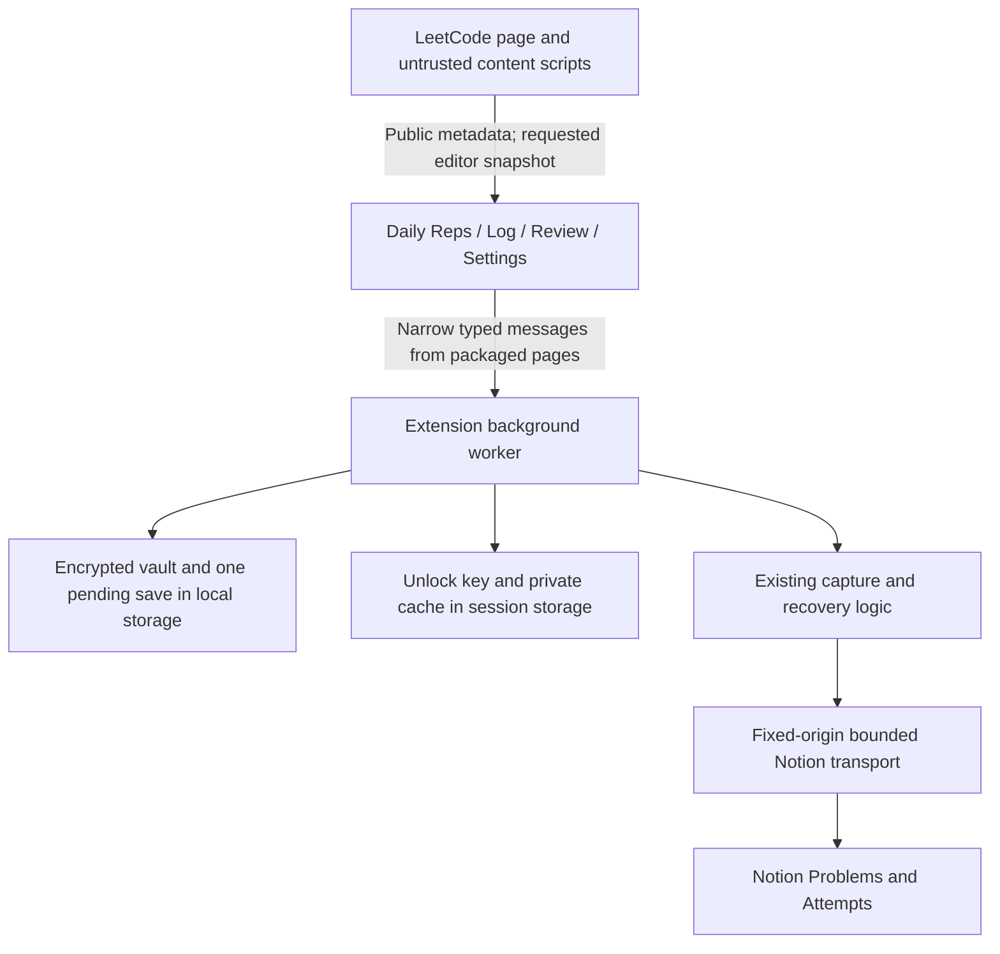

# Direct Notion connection and integrated sidebar

Status: implemented release specification, prepared 2026-09-03 and completed 2026-09-04. Synthetic
validation uses disposable profiles and fixtures. Installed extensions, real credentials, and live
Notion data have not been changed by this work.

Companion: [implementation plan and review decisions](DIRECT_NOTION_IMPLEMENTATION_PLAN.md).
This supersedes the native-helper runtime proposal. The
[approved sidebar concept](design/sidebar-approved.png) remains the visual reference.

## 1. Outcome and scope

LCTrack runs entirely inside the Chrome extension for everyday use. The background worker calls
Notion directly using a dedicated internal integration. The user connects once, saves the token
encrypted with a local passphrase, and unlocks once per browser session. There is no localhost
bridge, native helper, hosted service, OAuth flow, account system, or recurring hosting charge.

The scope is one personal tracker in one normal Chrome profile. Daily Reps remains independent
and immediately usable. Log, Review, connection settings, and recovery all live in the sidebar.
Retain the current TypeScript/HTML/CSS stack, Chrome 142 minimum, bundled fonts/icons, and exactly
two Notion databases. Existing setup/migration/maintenance commands remain separate advanced tools;
the extension does not provision or migrate Notion databases in this overhaul.

Preserve External Key and Client Event ID, stable latest Attempt page IDs, review transitions,
timestamps, managed retry receipts, unrelated Notion notes, existing Daily Reps records, goals,
session boundaries, and the user's explicit outcome confirmation. No private LeetCode APIs,
cookies, request interception, scraping, automatic capture, or historical cleanup.

### Deliberate security-boundary change

The user's direct-connection direction replaces the earlier requirement that the Notion credential
never enter extension storage. The replacement requirement is:

> Persist only an encrypted token and encrypted recovery payload. Never include a real token,
> passphrase, or unwrapped key in source, builds, logs, diagnostics, sync storage, or persistent
> plaintext storage. While unlocked, trust the packaged extension with the usable credential.

`AGENTS.md` remains unchanged. This recorded session decision is the explicit exception for the
overhaul; all other project boundaries and release gates still apply. README, architecture, and
security documentation now describe the direct extension; legacy bridge guidance is archived
separately for rollback and maintenance.

## 2. Architecture and ownership

- The worker owns vault changes, authorization state, Notion requests, the single pending-save slot,
  request scheduling, schema verification, and Review snapshots. UI modules do not construct Notion
  requests or choose API paths. Register event listeners synchronously, then await a shared
  initialization barrier inside handlers.
- Reuse `CaptureService`, `LatestAttemptStore`, shared contracts, and repository semantics. Extract
  file-based manifest loading and the Node factory from `notion-repository.ts`; do not import the
  HTTP server, filesystem settings, dashboard HTML, or CLI entry points into Chrome.
- Use the installed Notion SDK with its API version pinned to `2026-03-11`, retries disabled, a
  sanitized/no-op logger, and injected fetch. The production bundle contains no Node imports, and
  actual MV3 execution is covered by the browser gate.
- Content-script events publish metadata and invalidation signals without code. Request the full
  editor model only for unlocked Log and a confirmed capture. Continue supporting Monaco,
  CodeMirror, Accepted routes, delayed hydration, and SPA changes. Lock/navigation generations
  reject late snapshots; metadata remains available to Daily Reps.
  Bump the extraction protocol version, reject old code-bearing publications, and reinject the
  matching scripts through the existing recovery path; do not accept stale messages after reload.
- Do not keep a worker alive with pings, ports, alarms, background polling, or an offscreen document.
  Chrome may terminate it; session storage and the encrypted journal carry the necessary state.

### Typed operation contract

Use versioned, size-bounded requests with a correlation ID, discriminated results, and stable
sanitized error codes. Check `sender.id` and an exact allowlist of packaged page URLs before work.
Messages never contain a caller-selected API URL, method, header, or generic Notion request.
Every private response carries vault identity, execution generation, operation ID, and a monotonic
session state revision so an already-in-transit reply cannot replace newer data; source-tab
results also carry their navigation generation. Panels independently discard stale responses,
including a reply already in transit when Lock or navigation occurred.

| Operations                                                                        | Rules                                                                                                                            |
| --------------------------------------------------------------------------------- | -------------------------------------------------------------------------------------------------------------------------------- |
| `connection.state`, `connection.connect`, `connection.unlock`, `connection.lock`  | Return public state while locked and local private state while unlocked; credential inputs accepted only from shared Settings UI |
| `connection.changePassphrase`, `connection.replaceToken`, `connection.disconnect` | Serialize vault maintenance; connection changes cannot retarget a pending save                                                   |
| `capture.submit`                                                                  | Accept one frozen, confirmed event and source context; persist before any mutation                                               |
| `capture.pending`, `capture.retry`, `capture.check`                               | Return private details only unlocked; retry/check use the stored event ID, never a replacement body from the UI                  |
| `problem.status`, `review.read`, `review.refresh`                                 | Read-only; require unlock; bounded/coalesced; no capture side effects                                                            |
| `preferences.setGoal`, `preferences.resetSession`                                 | Local preferences only; reset requires UI confirmation; worker supplies the timestamp                                            |
| Existing Daily Reps operations                                                    | Preserve current contract and storage behavior; independent of Notion state                                                      |

A subscription may broadcast public state changes to open panels; it must not create heartbeat
traffic. Never broadcast token/key values. Recovery state is profile-wide; presentation/source-tab
state remains tab-scoped. Separate unsupported version, locked, storage failure, busy, schema
mismatch, authentication, permission, capacity, rate limit, unavailable, and uncertain-save errors.

## 3. Credential vault

### Storage and cryptography

Await `setAccessLevel({ accessLevel: 'TRUSTED_CONTEXTS' })` for both local and session storage before
sensitive handling. This excludes content scripts, but **includes packaged extension pages**.
It is not a worker-only secrecy boundary. [Chrome storage](https://developer.chrome.com/docs/extensions/reference/api/storage)

One versioned `chrome.storage.local` root record holds the wrapped key, encrypted credential and
tracker configuration, encrypted Notion preferences, and at most one encrypted pending capture
with recovery checkpoints. Serialize all root-record updates. Preserve the existing Daily Reps
record separately; never call global storage clear. Do not introduce IndexedDB or another database.
Two small nonsecret safety records live outside the encrypted root: the most recently revoked
session-grant ID, and a manual-reconciliation-required flag after discarding unresolved recovery.
They contain no token, key, code, or problem details. They are independent fail-closed gates,
not a multi-key transaction for saving the vault.

| Version 1 parameter    | Decision                                                                                                                  |
| ---------------------- | ------------------------------------------------------------------------------------------------------------------------- |
| Password derivation    | Web Crypto PBKDF2-HMAC-SHA-256, exactly 600,000 iterations, random 16-byte salt                                           |
| Wrapped secret         | Independently random 256-bit data key; password change rewraps this key                                                   |
| Encryption             | AES-256-GCM, fresh random 12-byte IV for every encryption, 128-bit tag                                                    |
| Authenticated metadata | Format/version, vault ID, record purpose, immutable canonical tracker-binding digest; pending records also bind event ID  |
| Passphrase input       | At least 16 characters; recommend several random words; maximum 1,024 UTF-8 bytes; no silent trimming/normalization       |
| Input bounds           | Token at most 4 KiB; confirmed event at most 128 KiB serialized UTF-8, retaining the existing 20,000-character code limit |
| Root-record bound      | At most 1 MiB serialized, including encrypted checkpoints; reject excess without overwriting state                        |

These are application defaults, not claims that PBKDF2 is universally the strongest KDF. Native
Web Crypto avoids adding a cryptographic runtime. Use standard primitives; no custom cipher or
hardcoded decryption key. Reject unsupported algorithms/versions/iteration counts, extra fields,
invalid encoding/lengths, and oversized input before expensive derivation. Serialize unlock attempts.
[Web Crypto](https://www.w3.org/TR/webcrypto/), [OWASP KDF guidance](https://cheatsheetseries.owasp.org/cheatsheets/Password_Storage_Cheat_Sheet.html)

`chrome.storage.session` holds the data-key bytes plus vault/key identity, a random session-grant ID,
and execution generation. Hydration and dispatch reject a grant matching the persisted revoked ID.
The worker imports a nonextractable CryptoKey and decrypts credentials only for authorized work.
The session bytes are themselves credential-equivalent; nonextractable import does not change that.
Do not store a plaintext token in session storage. Private Review/status caches may live in session
storage while unlocked and are purged on Lock. Plaintext pending code is not persisted there.

Keep immutable tracker IDs inside authenticated encrypted configuration and recompute their binding
after decryption. Do not trust a separate editable manifest to select write targets. Never persist
the user's passphrase. Clear input fields on submit, failure completion, cancel, and unmount.

### Lifecycle and maintenance

| Trigger                                               | Required behavior                                                                                                                 |
| ----------------------------------------------------- | --------------------------------------------------------------------------------------------------------------------------------- |
| Worker retirement                                     | Unlock survives through session storage; in-memory clients are recreated; no request starts merely on hydration                   |
| Chrome restart / extension reload, update, or disable | Session key disappears; vault and encrypted pending event remain locked                                                           |
| Sidebar closes                                        | Does not lock or cancel an already confirmed operation                                                                            |
| Lock now                                              | Fence new work immediately, best-effort abort active requests, clear session authority/private caches and all panel private views |
| Incorrect passphrase / corrupt ciphertext             | Preserve existing bytes; report `Passphrase incorrect or saved connection damaged`                                                |
| Change passphrase                                     | No active operation; authenticate old passphrase, rewrap same key with fresh salt/IV, persist and verify before success           |
| Replace token                                         | No active operation; read-only validation against the same immutable tracker binding; preserve pending data; no automatic retry   |
| Disconnect / forgotten-passphrase reset               | Explicit local destructive confirmation; remove Notion vault/private state only; leave Daily Reps and Notion untouched            |

Closing the last window is not necessarily a full Chrome exit. Explain this in Settings. Check the
execution generation before each request and before committing any private result; stale unlock,
connect, rekey, or fetch completions cannot reverse Lock. If clearing session authority fails, deny
further work in the current worker and report the lock failure with retry/full-browser-exit guidance;
never announce successful locking while the session key remains accessible. Lock also persists the
current grant's revocation so a restarted worker rejects a leftover session key. If both revocation
persistence and key removal fail, durable denial is not guaranteed: report `Lock failed` and require
full Chrome exit before proceeding. A later successful explicit unlock creates a new grant only
after password verification; it cannot revive an in-flight operation from the old grant.

Lock cannot undo a request already accepted by Notion. After possible mutation dispatch, retain
pending recovery and show `Save needs verification`. Aborting is not proof of failure. A passphrase
change is committed only after read-back; interruption may leave the old or new valid envelope,
so do not promise an unacknowledged change left the old password active. A failed maintenance
operation must never replace valid state with defaults or silently lose pending data.

With unresolved work, disconnect/reset explicitly states: `A pending save may already exist in
Notion. Removing local recovery does not undo it.` Do not offer routine discard/cancel for a
possibly dispatched save. No password recovery service, token reveal/export, automatic clipboard
writes, or permanent auto-unlock in the MVP. Changing the passphrase cannot secure old vault copies;
revoking a compromised token is a separate action in Notion.
Before deleting unresolved encrypted recovery, persist the manual-reconciliation-required flag.
If that write fails, do not delete the vault. A fresh connection may validate/read but cannot capture
until the user explicitly confirms that they inspected and reconciled the uncertain Notion result.
This is a disclosed manual recovery path, not proof obtained by deleting local records.

### Limits of the protection

This protects encrypted data in a copied, locked profile subject to passphrase strength. It does
not protect against malicious packaged extension code, a compromised browser/OS, or memory access
while unlocked. JavaScript does not guarantee physical memory erasure. User-selected integration
sharing limits exposure; read-only connection verification cannot prove that no broader pages were
shared. A dedicated internal integration should have only needed read/insert/update capabilities
and access to Problems/Attempts and their contents. Parent sharing includes children.
[Notion internal connections](https://developers.notion.com/guides/get-started/internal-connections)

## 4. Saves, interruption, and recovery

The personal MVP admits **one unresolved Notion capture globally**. It is a recovery journal, not
an offline queue. Another panel receives a busy/pending state; it cannot replace the event. Daily
Reps remains usable. Local preference/vault edits are serialized with journal persistence so an
older root snapshot cannot overwrite a newer pending record.

1. A deliberate outcome click validates the source tab/fingerprint and freezes the full event,
   including exact code, timestamp, outcome, External Key, and UUID. Do not regenerate it on retry.
2. Encrypt and persist the event; await persistence and read-back verification before any mutation.
   If storage is full/unavailable, no new write is dispatched.
3. Execute the shared capture service against fresh request-local Notion state. Review caches never
   drive reconciliation. Journal mutation checkpoints before dispatch and validated outcomes after.
4. Success requires complete Attempt/Problem writes and completed managed receipts. In one
   serialized root update replace pending with an encrypted, code-free completed receipt containing
   event ID, exact-body digest, result, source context, and completion time; verify before success.
   If local completion persistence fails, retain/recover the pending event rather than offer a new UUID.
5. Any uncertain interruption retains the original encrypted event. After restart/unlock, show it;
   do not automatically submit. `Retry same attempt` resumes only on an explicit user action.

Retain the most recent completed receipt until another capture successfully replaces it or the
connection is explicitly reset. `capture.pending` returns pending and the last completed result
while unlocked, so a lost UI reply is recovered before offering another save. Resubmission of a
locally retained event returns its known state/result and rejects a changed body digest. A genuinely
new outcome click uses a new UUID and may proceed when no pending record remains. Older historical
receipts retain existing UUID-based semantics; they do not contain enough data to prove exact code
equality, so do not claim unbounded historical body-digest verification.

### Non-idempotent operations need stronger protection

Notion External Key is a lookup key, not a database uniqueness constraint. The current repository
can recreate a Problem or Attempt if a creation response is lost and a subsequent query does not
yet reveal the page. Block append has the same hazard. The overhaul must close this gap.

- Before each page create or block append, durably record the operation kind, exact parent/target,
  semantic payload fingerprint, original event identity, and expected result identifiers if known.
  Local storage failure stops dispatch. Persist validated returned IDs before advancing.
- On an ambiguous response, `Check saved result` performs read-only recovery: enumerate candidates
  for the exact Problem key, Attempt event/problem key, or children under the exact managed parent.
  Require one positively validated match, including expected properties/relations/receipt content.
- Retain a resolved checkpoint and make the repository mutation gateway reuse the retrieved
  page/blocks for that same intent. Do not simply delete the intent and rerun a query-then-create.
  Once resolved, validate stable identity/parent/binding and allow legitimate later property
  updates; do not require the page to retain its original creation properties forever.
- Empty, duplicate, malformed, or incomplete results remain `Needs verification`; no create/append
  is repeated. Waiting a fixed time does not prove the original request failed.
- A definitely rejected individual request can release its own intent, but cannot erase the entire
  pending event if earlier requests may have changed Notion. A late 401/403 is not proof of rollback.
- Some ambiguous cases require manual inspection/reconciliation; the MVP must expose this limitation
  rather than claim unconditional exactly-once delivery. It never automatically deletes duplicates.

Bound the journal; store necessary semantic checkpoints instead of an unbounded API transcript.
Checkpoints remain until the whole capture completes. Routine existing-page reconciliation must
retain its current behavior, stable page links, notes, timestamps, and compact receipts.

`capture.check` uses a separate read-only inspector. It must not call `CaptureService.capture`,
reconciliation helpers, or `LatestAttemptStore.latest()`: the latter can finish pending receipts
and mutate Notion. Checking may update local checkpoints, but sends zero remote mutations. A result
requiring remaining writes offers the separate explicit Retry action.

### Transport and lifecycle budget

Allow only `https://api.notion.com/v1/` and an explicit table of operations needed by the repository
and connection verifier. Classify read-only query POSTs separately from mutations. Reject redirects,
omit ambient credentials, remove unsupported Node/SDK request options, and sanitize errors before
they reach UI/logs. Restrict production `connect-src` to Notion; use packaged scripts/styles only.

Use a shared request scheduler across reads and writes, with one in-flight request, a token bucket
of three requests refilling at three per second, and at most two retries for a safe read. Respect
`Retry-After` on 429 and 529;
persist a credential-free cooldown timestamp across worker retirement. Do not retry arbitrary
mutation failures in fetch/SDK. Retry a capture through journal-aware reconciliation. Distinguish
permission, authentication, and capacity errors. [Notion limits](https://developers.notion.com/reference/request-limits)
Key the persisted cooldown to the authenticated tracker/integration binding and honor it after
full restart; token replacement must not bypass a known workspace cooldown. Rate controls are
conservative defaults, not a guarantee against limits shared with other Notion clients.

Initial budgets: abort a single fetch, including body consumption, after 20 seconds; bound a user
operation to 120 seconds. Before each dispatch check unlock generation, deadline, cooldown, and
journal persistence. A wait of more than 10 seconds yields a rate-limited/retry-later state rather
than maintaining a sleeper. Use bounded retries for safe reads only; settle or retain pending on
deadline. No hidden keepalive or indefinite retry loop. These budgets are implementation defaults
to validate against realistic fixtures, not Notion latency promises.

Chrome can end workers after inactivity, a slow response, or a long event. Awaited JavaScript alone
does not guarantee survival. Persistence and recovery must pass forced-termination tests.
[Worker lifecycle](https://developer.chrome.com/docs/extensions/develop/concepts/service-workers/lifecycle)

Single-profile serialization does not protect another Chrome profile, computer, or a concurrently
running old bridge. Support one writer installation; explicitly stop legacy writers at cutover.
Do not invent a Notion-property lease or claim a distributed lock. A remote coordination service
and multi-device simultaneous writes remain outside this MVP.

## 5. Review, preferences, and private data

Reuse current dashboard meanings: new Problems counted from First Attempt (today until the existing
optional session boundary is set); due rows on/before the browser-local date; four combined local
filters and title search. Preserve optional Grind properties and existing schema compatibility.

Fetch on entering unlocked Review when no valid snapshot exists, explicit Refresh, or after a save
invalidates a visible Review. Coalesce duplicate requests across panels. A hidden Review creates no
prefetch. Daily Reps, unlocking from Daily Reps, and idle panels create no Notion traffic.

Load all API pages before reporting fresh complete counts. Render results in batches of 20 with
`Show more`; this is display pagination, not silent truncation. If a deadline/bound is reached,
keep the prior snapshot stale or show an incomplete-load error. Never replace it with partial fresh
counts. A very large tracker may need a later resumable read design; do not add that system now.

Session caches are labeled with timestamp, local date, configuration generation, and preference
generation. Late results from an old goal/session reset cannot overwrite newer state. While offline
and unlocked, retain the last valid snapshot with a stale label; search/filter still work. Lock
clears private rows, counts, status, and code across all panels, leaving only a pending-presence flag.

Notion preferences live encrypted in the vault and are distinct from Daily Reps. Preserve the
imported 1–100 goal and optional exact session timestamp. Explicit reset changes only the local
count boundary using worker-generated time; never mutate Notion or Daily Reps. Commit preferences
before announcing success and refresh a visible Review using the new generation.

## 6. Sidebar specification

Use the frontend-app-builder skill to implement and verify this existing accepted design. Missing
states extend the same system; no new visual direction or framework is needed. The reference is
not a production UI bitmap and its example names/counts/success text are not defaults.

### Shell and layout

- Terminal mark, `LC TRACK`, accessible Settings gear, three equal tabs: `Daily Reps`, `Log`, `Review`.
  Daily Reps is initial whenever a panel opens; active tab is black/white. Settings is a subview
  with Back, restoring invoking focus/scroll. Keep existing tab-scoped panel and shortcut behavior.
- Preserve cream/black/pink/cobalt palette, Inter/IBM Plex Mono, restrained borders, compact open
  sections, and divider-separated Review rows. Reuse existing design tokens; verify color and icon
  fidelity against the image before changing token values. No nested card redesign or decorative copy.
- Validate widths 320/360/400/480 CSS px and heights 480/700/900 px. Use 12 px gutters at narrow widths
  and 16 px at wider widths. Long titles wrap. One vertical content scroller; no horizontal page scroll.
- Body/controls approximately 14 px, section headings 18–20 px, problem title 20–24 px. Use explicit
  control typography and visible focus; do not shrink labels to force fit. Text zoom must remain usable.
- Code preview initially expanded within about 160–200 px height; expansion is taller but bounded.
  Horizontal scrolling stays inside the labeled code region. The saved payload is the full model.

### View and state inventory

| Surface    | Normal content and required additional states                                                                                                                                                                                                                              |
| ---------- | -------------------------------------------------------------------------------------------------------------------------------------------------------------------------------------------------------------------------------------------------------------------------- |
| Daily Reps | Preserve goal, repeated entries, removals, Finish & reset, history, and no midnight reset. No connection/unlock requirement. Metadata only.                                                                                                                                |
| Log        | Current problem/difficulty/status/topics → code language/lines/preview → outcome buttons → result/next review. Support unsupported tab, loading/hydration, no code, unconfigured, locked, saving, success, read error, and global recovery.                                |
| Review     | Updated time/Refresh → pink two-column summary → search → All due/Today/Overdue/Needed help → rows → Show more → confirmed session reset. Support loading without fake zeros, stale, locked, empty due list, no search matches, rate limit, auth/permission/schema errors. |
| Settings   | Shared connection/import, unlock, Lock now, Change passphrase, Replace token, Disconnect, forgotten-passphrase reset, pending recovery. No separate credential implementation in options.html.                                                                             |

Log keeps `How did this attempt go?`, `Needed help`, `Solved`, and `Saved to Notion`. Replace the
illustrative footer with `Each confirmed outcome records a repetition and updates the saved solution.`
Do not imply that each click creates another Notion page. Never substitute `New` for failed status reads.

Locked Log can show public current-problem metadata but replaces code/private status/outcomes with
`Unlock Notion`. Unlocking refreshes the original source-tab context, and never submits an outcome.
During a save, disable both outcomes and show `Saving to Notion…`. Navigation cannot change the
frozen event. Review links open the canonical LeetCode problem in a new tab so the current editor
is preserved; opening LCTrack on the new tab remains explicit.

Recovery is reachable in Log and Settings even after the original tab closes. Unlocked recovery
shows original problem/outcome/time and bounded code preview. Use `Retry same attempt` only when
journal-aware replay is safe; use read-only `Check saved result` for unresolved create/append intent.
While locked, show only `Unlock to check pending save`. Never offer retry with the current editor
or a new UUID. Another problem displays `Finish the pending save before logging another attempt.`

Use semantic tabs with arrow/Home/End navigation, labeled controls, text-safe rendering, associated
field errors, live save/error announcements, focus restoration, Escape/cancel on confirmations,
adequate contrast/targets, and reduced-motion support. Large dialogs scroll within the side panel.
Lock purges sensitive fields/views even if a dialog is open or another panel is showing Review.

## 7. First connection, cutover, and rollback

Connection is an explicit in-panel flow, with no `.env` reader or automatic token migration:

1. Import the existing token-free version-4 manifest. Strictly validate fields, UUIDs, API/schema
   version, distinct database/data-source IDs, and size. Reject unknown keys, token-shaped values,
   duplicate/conflicting targets, and malformed files before storing anything.
2. Preview and import existing dashboard preferences. Support the existing token-free settings file;
   an optional future-purpose export command may combine only allowlisted manifest/preferences.
   When preferences are unavailable, show the proposed goal/boundary explicitly before confirmation;
   do not silently reset an existing Notion session.
3. Instruct the user to stop all old writers and use one normal Chrome profile. Paste a dedicated
   internal-integration token into Settings and choose/confirm a passphrase. Explain:
   `This passphrase protects your saved connection on this browser. It is not your Notion password.`
4. `Connect Notion` verifies the exact two database/data-source identities, required v4 properties,
   reciprocal relations, and allowed optional Grind fields through read-only calls. Reuse portable
   schema checks, not the CLI's view/presentation requirements. It cannot prove write capability
   without a write; do not claim that it did or create a test page.
5. Persist/verify the complete encrypted envelope, establish session unlock, and return to Log or
   Review. Any failed validation leaves the old vault intact and no partly connected state. Success
   does not log an attempt. Avoid background network work when the initiating view is Daily Reps.

At runtime cutover, remove localhost host permissions and everyday bridge/dashboard actions, add
only `https://api.notion.com/*`, and use a restrictive extension CSP. Keep Chrome options as a
token-free launcher/help page with a user-gesture `Open LCTrack Settings` button. It must not mount
credential inputs or render Settings outside the sidebar. If opening fails, explain how to open
LCTrack using its toolbar action; never fall back to a standalone credentials form.
Incognito writes and multiple profiles are unsupported;
refuse incognito connection/capture rather than silently create another writer.

Pending legacy per-tab captures require special handling: before reloading into the new extension,
resolve them with the old version or explicitly preserve their exact bodies via a bounded migration
handoff. Session storage may disappear on update, so the new version cannot promise to discover them
afterward. Default cutover requires zero pending legacy saves, keeping this MVP migration small.
Keep the same extension load path/identity to preserve Daily Reps, shortcuts, and profile storage.

Never copy real secrets into the repository or silently remove/rotate the existing `.env` token.
Stopping legacy launchers is a user cutover step; revoking their credential is the stronger optional
separation if feasible. Read-only import is not a lock against another writer. Existing maintenance
commands must run with direct capture locked/stopped and appropriate credentials supplied separately.

Rollback preserves the old release and token-free configuration/preferences. Stop/lock direct writes
and wait for old dispatched work to settle. Resolve pending through positive verification or explicit
manual Notion reconciliation before restoring any legacy writes. Merely retaining the encrypted
journal permits inspection/manual recovery, not resumed capture through an older unguarded bridge.
Restore any changed goal/session boundary by an allowlisted preference export;
do not roll back Notion data or Daily Reps. No automatic bridge fallback or simultaneous transport.

## 8. Observable completion criteria

- Everyday Daily Reps/Log/Review/settings work without any local helper or hosted service.
- Dedicated token and pending code appear only encrypted in persistent storage; trusted session
  key disappears on successful Lock/browser restart and never reaches page scripts or diagnostics.
- One unresolved event survives forced worker termination and full restart, remains bound to its
  tracker, and never auto-submits. Lost create/append responses cannot cause blind duplication.
- Existing successful capture fixtures preserve 6/10/5 Notion request budgets and stable page IDs;
  recovery/pagination may add justified reads. No claim of universal exactly-once delivery.
- Daily Reps/history and imported Notion preferences survive migration; private cache and late
  snapshot races cannot reveal data after Lock.
- Rendered Log/Review match the approved concept, all specified states work at target sizes, and
  keyboard/screen-reader behavior passes the implementation acceptance matrix.
- The full repository gate passes. A direct-mode benchmark measures unlock, warm/cold saves,
  worker retirement, bundle size, and idle traffic. The native benchmark is historical context,
  not evidence of direct-mode CPU, memory, or battery performance.
