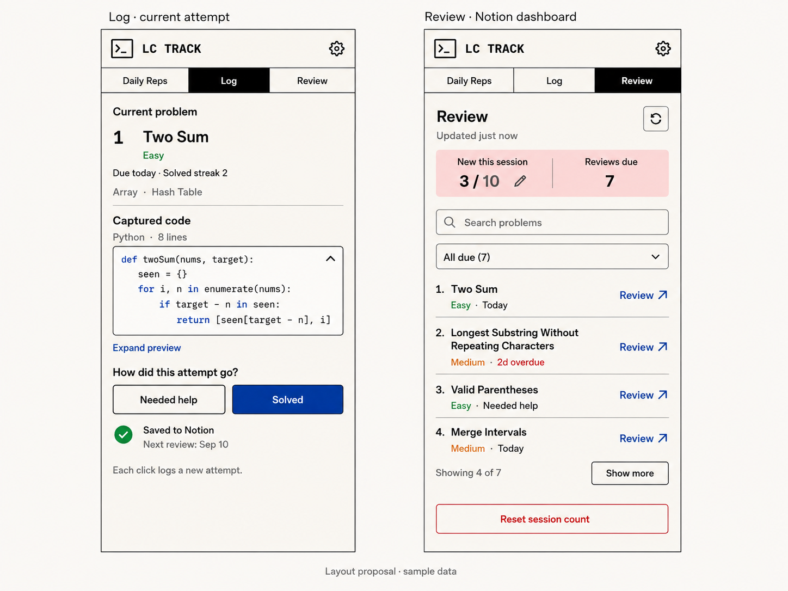

# Native helper and integrated sidebar

> Historical implementation record. For current operation, use the [documentation index](README.md).
> Review-tab designs and acceptance evidence describe the earlier release; the current sidebar
> has Daily Reps and Log, with review in Notion. Security and recovery details remain relevant.

Superseded runtime proposal: the user selected direct extension-to-Notion planning after reviewing
the benchmark. See [Direct Notion specification](DIRECT_NOTION_SPEC.md) and
[implementation plan](DIRECT_NOTION_IMPLEMENTATION_PLAN.md). The approved sidebar visual below
remains current; the native-helper design and measurements are retained as historical context.

Status: visual direction approved and synthetic benchmark completed on 2026-09-03. This document
records the agreed design and proposed implementation sequence; the production runtime is not implemented.

## Intended outcome

Use LCTrack without manually opening a bridge app or keeping it running continuously.
Keep the everyday log, review dashboard, and settings inside the Chrome side panel.
Keep the Notion token outside extension source, storage, logs, and build output.

The preferred architecture is an on-demand native messaging helper. Removing the external
dashboard removes the main reason to prefer a socket-activated HTTP bridge. Socket activation
remains a fallback to evaluate if native messaging has a material installation or lifecycle issue.
No cloud hosting, OAuth, framework change, or additional application database is planned.

## Approved visual reference



The image is the visual reference for Log and Review. Its problem names, code, dates,
counts, and success message are sample data, not live state or product defaults.
Daily Reps retains its existing functionality and remains the initial view.

| View       | Contents                                                                                                                                               |
| ---------- | ------------------------------------------------------------------------------------------------------------------------------------------------------ |
| Daily Reps | Browser-local repetition goal, current session, and archived session history.                                                                          |
| Log        | Current problem, difficulty, review state, topics, bounded expandable code preview, outcome actions, and save feedback.                                |
| Review     | Notion new-problem session progress, editable maximum, due count, search, filter, review rows, more-results action, and confirmed session-count reset. |

Preserve the reference's cream, black, pink, and cobalt palette, restrained typography,
terminal mark, three-column navigation, compact metadata, dividers, and control hierarchy.
Build real HTML/CSS controls using the existing TypeScript stack; the image is not a UI asset.
Use the gear to reach settings within the panel. The existing external Dashboard action is retired
only after the integrated replacement is verified.

Layout requirements:

- Design and verify around 320, 360, 400, and 480 CSS pixels wide, including short windows.
- Allow long titles to wrap. Avoid horizontal page scrolling and clipped controls.
- Bound the code preview and allow expansion. Capture the full editor model regardless of preview size.
- Use one dropdown for All due, Today, Overdue, and Needed help; search/filter the loaded snapshot locally.
- Preserve all review results through progressive rendering or pagination; never silently truncate them.
- Keep outcome controls reachable, with keyboard focus, accessible names, and status announcements.
- Session reset requires confirmation and changes only the Notion dashboard's local count boundary.
- Keep Daily Reps counts/goals separate from Notion new-problem counts/goals.

The concept does not specify loading, empty, error, retry, settings, expanded-code, or narrow-window
states. Design these in the same visual system before implementing them.

## Runtime design

```text
Side panel: Daily Reps / Log / Review / Settings
  → extension service worker
  → one shared native messaging connection per browser profile
  → on-demand helper with exclusive tracker writer ownership
  → existing capture/recovery logic
  → Notion Problems and Attempts
```

- Reuse the capture service, repository, review transitions, and exact two-database schema.
- Build helper JavaScript ahead of time and run it directly with Node; avoid watch mode and runtime
  TypeScript tooling in the normal launch path. Native messaging does not imply a Swift rewrite.
- Start only for an explicit Notion operation. Daily Reps must not launch the helper.
- Reuse the connection for pending work and nearby requests; use a five-second idle grace period
  as the initial policy recommended by the benchmark. Close only after active work settles.
- Do not keep the native port open merely because a side panel is visible. Do not add polling,
  heartbeat traffic, unconditional reconnect, or a login service to keep it alive.
- Prevent simultaneous writers across profiles and the legacy bridge. Existing in-process locks
  alone cannot protect separate helper processes. A second writer must wait safely or fail clearly.
- Close only after in-flight work settles. A disconnect or crash after dispatch is an uncertain save,
  not evidence that Notion rejected the event.
- Preserve External Key, Client Event ID, exact retry bodies, stable Attempt pages, pending receipts,
  and recovery before another capture. Report success only when the Notion writes finish.
- Retain an explicitly stale, credential-free dashboard snapshot for the browser session so Review
  can remain visible while the helper sleeps. Fetch on opening when needed, explicit refresh, or
  invalidation following a completed save when Review is visible. Coalesce duplicate refreshes.
- Keep capture snapshots request-local. Cached dashboard data must never drive write reconciliation.
- Keep existing dashboard goals and session boundary during migration; do not reset user progress.

Use a versioned, size-bounded protocol with specific operations for capture, status, dashboard,
and bounded settings changes. The host accepts the configured extension identity; extension
messages accept only trusted extension pages. No arbitrary URL, command, file, or Notion proxy.

Credential target: macOS Keychain, with access controls and executable identity verified during
the prototype. The existing local credential file is the comparison baseline. Do not silently copy,
remove, expose, or rotate credentials as part of a benchmark or design exercise.

Current retry storage is browser-session scoped. Native messaging does not make it survive a full
browser restart. Any stronger restart guarantee requires an explicit pending-event persistence
design; do not claim it is already provided by Notion receipts or an in-memory queue.

## Compute assessment and first implementation gate

The [completed synthetic benchmark](NATIVE_HELPER_BENCHMARK.md) measured lower active host CPU
and memory, and zero native-helper processes after idle. With 20 ms injected delay per Notion call,
median peak host RSS was 83 MiB versus 318 MiB for the existing launcher. Most of this saving also
appeared in the prebuilt HTTP control. Native startup was slower: 565 ms versus 379 ms for the launcher
and 111 ms for prebuilt HTTP. Repeated replacement latency was similar across all three.

Five seconds is the recommended initial idle grace period. Widely spaced requests pay extra startup
work; a 30-second grace period avoids more restarts but retains memory longer. The worker target
remained present in automated Chrome after helper exit, so worker retirement is not yet verified.
CPU time, elapsed time, memory, and battery impact are separate metrics; no battery claim is made.

The benchmark used identical synthetic Notion data, a thin native host, the current launcher,
and a prebuilt HTTP control. Socket activation remains a fallback if production installation or
lifecycle verification reveals a material native-messaging issue; it was not benchmarked.

Benchmark scope and follow-up measurements:

1. Cold-start and repeated-operation latency, including median and tail observations.
2. CPU time and peak/idle memory for the whole relevant process tree, including extension-worker effects.
3. Widely spaced saves, short bursts, concurrent tabs, Review opened/hidden, and Daily Reps only.
4. Notion call counts with dashboard work reported separately; no unrelated prefetch on every start.
5. Correct idle shutdown, zero helper processes after the grace period, and no unsolicited wakeups.
6. Credential lookup and network connection setup costs separately where measurable.

The existing single-page test fixture has capture budgets of 6 calls for a first capture, 10 for
a replacement, and 5 for a completed duplicate retry. Preserve those budgets; pagination and
recovery legitimately add calls. These are fixture counts, not live latency measurements.

Use no real tokens or live Notion writes for the synthetic benchmark. Report limitations explicitly;
CPU and memory counters alone do not establish a battery-life improvement.

## Implementation sequence and verification

1. **Benchmark prototype — complete:** synthetic resource costs and idle behavior measured; five-second
   grace recommended. Production credential lookup, worker retirement, and crash recovery remain gates.
2. **Complete UI specification:** cover missing states and responsive behavior using the approved concept.
3. **Native transport:** implement registration/build support, narrow dispatch, exclusive writer ownership,
   termination handling, and safe retry classification behind the existing capture interface.
4. **Integrated sidebar:** implement Log, Review, and settings; preserve Daily Reps and existing tracker data.
   Verify opening a review problem respects tab-scoped panel behavior and does not discard unsaved code.
5. **Verification and cutover:** validate the complete flow, then retire the everyday HTTP/dashboard dependency.
   Keep a documented, explicit rollback path that never permits concurrent legacy/native writers.

For behavior changes, write failing tests first. Cover partial/lost responses, crashes, concurrent tabs,
profile conflicts, repeated event IDs, helper absence, protocol mismatch, stale/empty data, and pagination.
Browser verification must compare the rendered interface with the approved reference and test keyboard
navigation, resizing, code expansion, outcomes, filters, goals, and reset confirmation.

Run `npm run check` before claiming implementation complete. For a shipped code change, synchronize the
release version in package.json, the root package-lock entry, and extension/manifest.json.
Planning-only changes do not require a version bump.

## Sources and current handoff

- [Chrome native messaging](https://developer.chrome.com/docs/extensions/develop/concepts/native-messaging)
- [Chrome worker lifecycle](https://developer.chrome.com/docs/extensions/develop/concepts/service-workers/lifecycle)
- [Chrome session storage](https://developer.chrome.com/docs/extensions/reference/api/storage)
- [Apple launch-on-demand services](https://developer.apple.com/library/archive/documentation/MacOSX/Conceptual/BPSystemStartup/Chapters/CreatingLaunchdJobs.html)
- [Apple Keychain protection](https://support.apple.com/guide/security/keychain-data-protection-secb0694df1a/web)

Completed: architecture research, source inspection, approval of the sidebar concept, planning,
and the synthetic native-messaging benchmark. See the linked report and `scripts/benchmark/README.md`.
Outstanding: detailed missing UI states, production transport and sidebar implementation, and validation.
Only a temporary benchmark profile received a synthetic host registration; it was removed afterward.
No production helper installation, credential migration, runtime change, or live Notion mutation occurred.
The checkout contains pre-existing code and documentation edits; preserve them when starting implementation.
